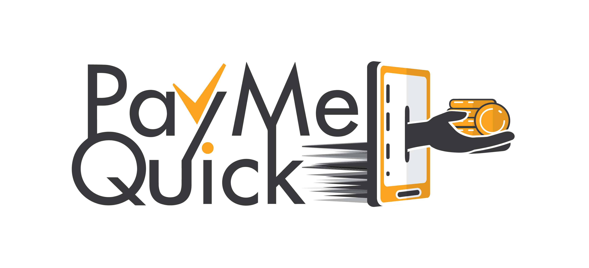

# Welcome to PAYMEQUICK CORE API

### What is PAYMEQUICK?

Paymequick is a payment platform API build entirely with Ruby/Ruby On Rails
### Framework and libraries

## Getting Started

1. Install paylequick at the command prompt if you haven't yet:

        $ gem install paymequick

2. At the command prompt, login with heroku cli to acces to application core:

        $ heroku login
        $ heroku git:clone -a paymequick

3. Change directory to `myapp` and start the web server:

        $ cd paymequick
        $ bin/rails server

   Run with `--help` or `-h` for options.

4. Go to `http://localhost:3000` and you'll see:
"Yay! You’re on Rails!"

5. Follow the guidelines to start developing your application. You may find
   the following resources handy:
    * [Getting Started with Rails](https://guides.rubyonrails.org/getting_started.html)
    * [Ruby on Rails Guides](https://guides.rubyonrails.org)
    * [The API Documentation](https://api.rubyonrails.org)

PAYMEQUICK CORE API.

Things you may want to cover:

* ruby 2.6.5p105 (2019-08-29 revision 67799) [x86_64-linux]

* System dependencies

* Configuration

* Database creation

* Database initialization

* How to run the test suite

* Services (job queues, cache servers, search engines, etc.)

* Deployment instructions

## Code Status

## Hosting powered by

## License

Paymequick is released under the [MIT License](https://opensource.org/licenses/MIT) by [MVONDO Yannick](mvondoyannick@gmail.com).
